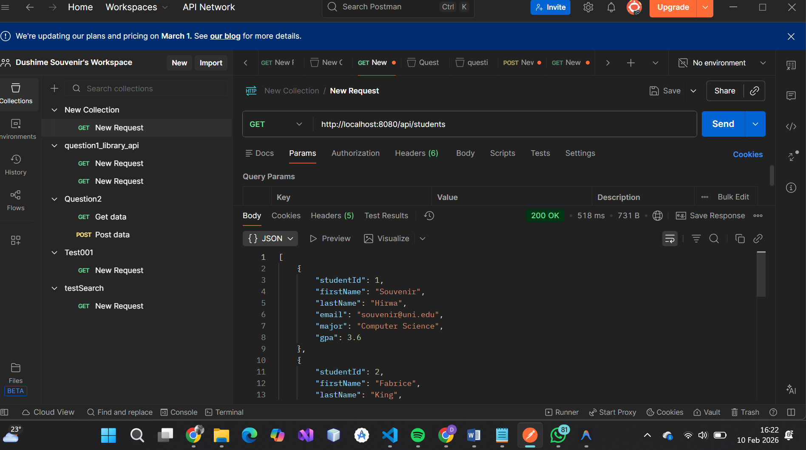
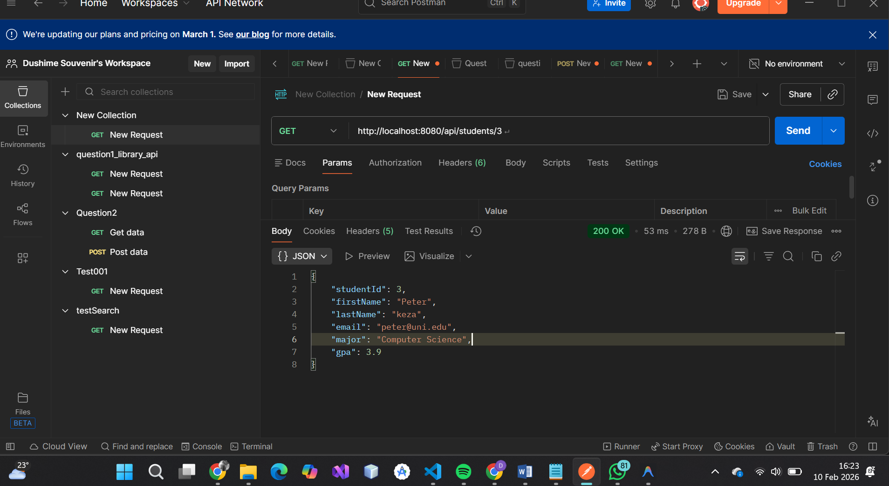
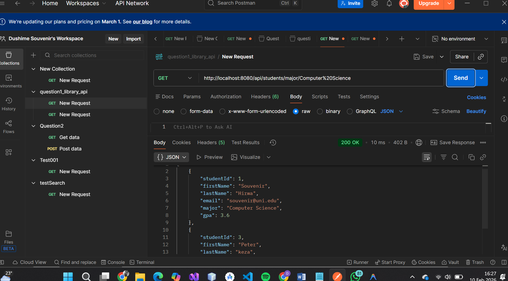
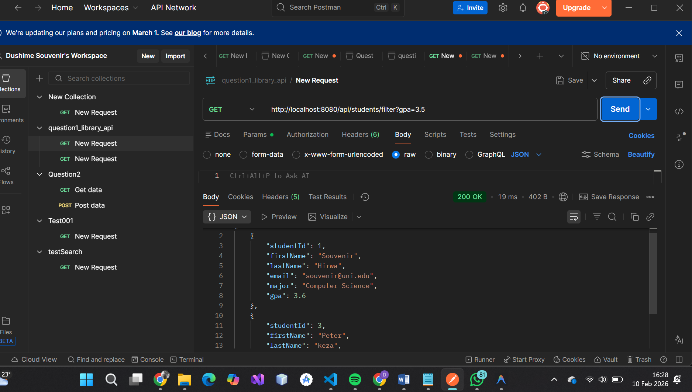
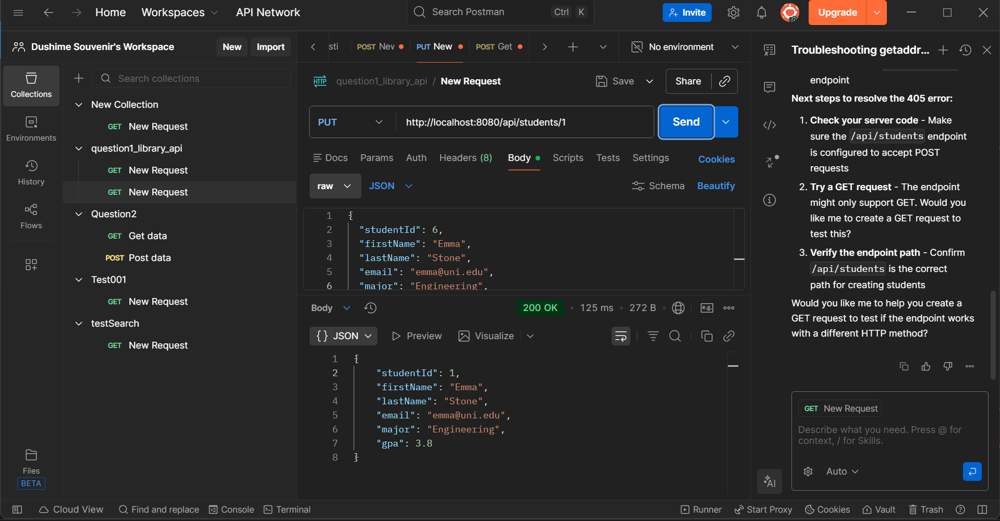

# Student Management API

This project is a Spring Boot application that provides a RESTful API for managing student records. It allows for retrieving student information, filtering by various criteria, and updating student details.

## Technologies Used

-   **Java 21**
-   **Spring Boot 3.x**
-   **Maven**

## Getting Started

### Prerequisites

-   Java Development Kit (JDK) 21 or later
-   Maven (optional, as the project includes the Maven Wrapper)

### Running the Application

1.  Clone the repository:
    ```bash
    git clone git@github.com:dush04souvenir/WebTech_Assignment2.git
    cd WebTech_Assignment2/question2_student_api
    ```

2.  Run the application using the Maven Wrapper:
    ```bash
    ./mvnw spring-boot:run
    ```

The application will start on `http://localhost:8080`.

## API Endpoints

### 1. Get All Students

Retrieves a list of all students.

-   **URL:** `/api/students`
-   **Method:** `GET`



### 2. Get Student by ID

Retrieves a specific student by their unique ID.

-   **URL:** `/api/students/{studentId}`
-   **Method:** `GET`
-   **Example:** `/api/students/1`



### 3. Get Students by Major

Retrieves a list of students enrolled in a specific major.

-   **URL:** `/api/students/major/{major}`
-   **Method:** `GET`
-   **Example:** `/api/students/major/Computer Science`



### 4. Filter Students by GPA

Retrieves a list of students with a GPA greater than or equal to the specified value.

-   **URL:** `/api/students/filter`
-   **Method:** `GET`
-   **Query Param:** `gpa` (Double)
-   **Example:** `/api/students/filter?gpa=3.5`



### 5. Update Student

Updates the details of an existing student.

-   **URL:** `/api/students/{studentId}`
-   **Method:** `PUT`
-   **Body:** JSON object representing the student details to update.

```json
{
    "firstName": "NewName",
    "lastName": "NewLastName",
    "email": "new.email@uni.edu",
    "major": "New Major",
    "gpa": 3.8
}
```


