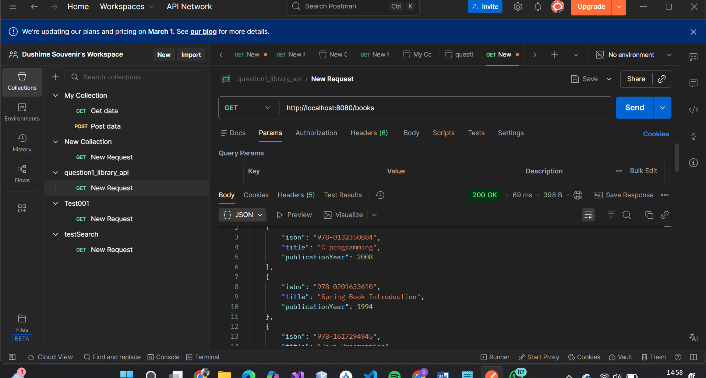
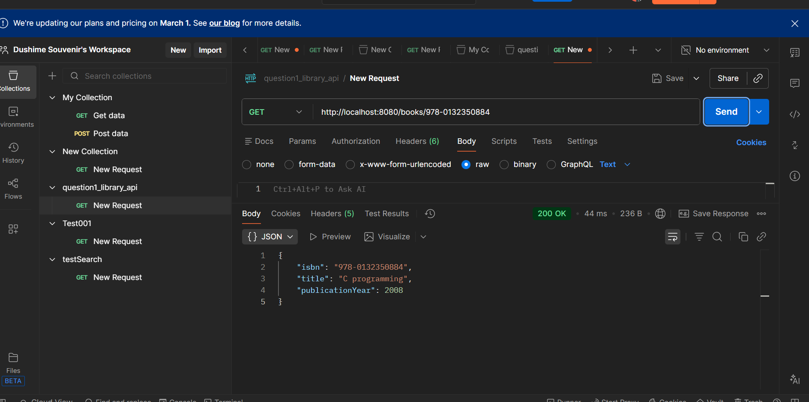
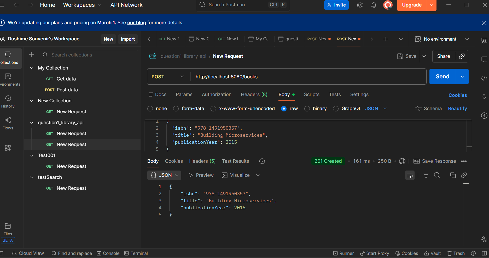
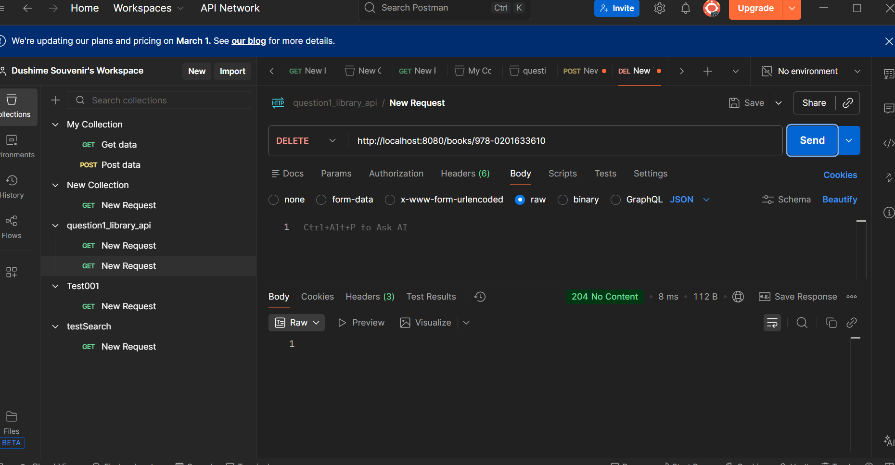

# Library API Project

This is a Spring Boot application that provides a RESTful API for managing a library of books. It allows users to add, retrieve, and delete books.

## Project Description

The **Library API** is designed to demonstrate basic CRUD (Create, Read, Update, Delete) operations using Spring Boot. It uses an in-memory list to store book data, making it easy to run and test without a dedicated database setup.

## Features

-   **Get All Books**: Retrieve a list of all books in the library.
-   **Get Book by ISBN**: Retrieve detailed information about a specific book using its ISBN.
-   **Add Book**: Add a new book to the library collection.
-   **Delete Book**: Remove a book from the library using its ISBN.

## Tech Stack

-   **Java 21**: The programming language used.
-   **Spring Boot 4.0.2**: The framework used for building the API.
-   **Maven**: Dependency management and build tool.

## Getting Started

### Prerequisites

-   Java Development Kit (JDK) 21 or later.
-   Maven 3.6 or later.
-   Git.

### Installation

1.  **Clone the repository**:
    ```bash
    git clone git@github.com:dush04souvenir/WebTech_Assignment2.git
    cd WebTech_Assignment2/question1_library_api
    ```

2.  **Build the project**:
    ```bash
    mvn clean install
    ```

3.  **Run the application**:
    ```bash
    mvn spring-boot:run
    ```

The application will start on `http://localhost:8080`.

## API Endpoints & Testing

You can use tools like Postman or cURL to test the API. Below are the available endpoints with screenshots demonstrating their usage.

### 1. Get All Books
-   **URL**: `GET /books`
-   **Description**: Retrieves a list of all books.
-   **Screenshot**:
    

### 2. Get Book by ISBN
-   **URL**: `GET /books/{isbn}`
-   **Description**: Retrieves a specific book by its ISBN.
    -   Example: `GET /books/978-0132350884`
-   **Screenshot**:
    

### 3. Add a New Book
-   **URL**: `POST /books`
-   **Description**: Adds a new book to the library.
-   **Body** (JSON):
    ```json
    {
      "isbn": "978-0134685991",
      "title": "Effective Java",
      "publicationYear": 2018
    }
    ```
-   **Screenshot**:
    

### 4. Delete a Book
-   **URL**: `DELETE /books/{isbn}`
-   **Description**: Deletes a book by its ISBN.
    -   Example: `DELETE /books/978-0132350884`
-   **Screenshot**:
    

## License

This project is part of a Web Technology assignment.
