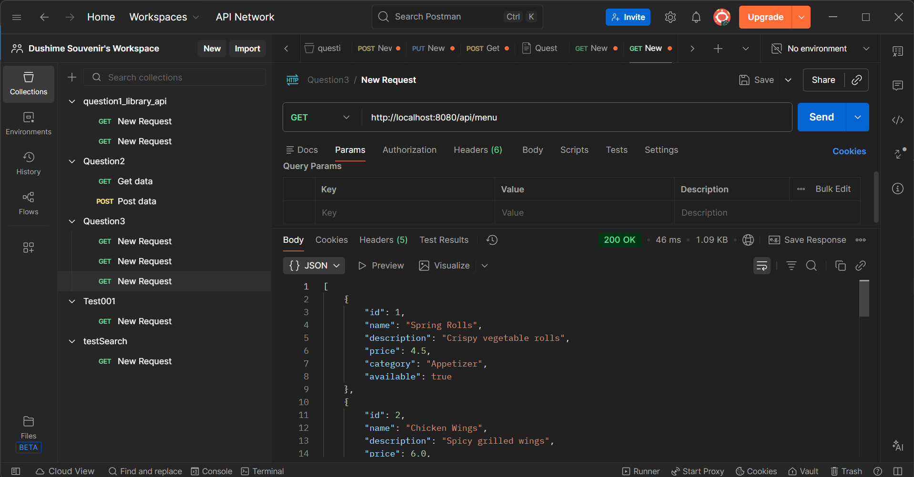
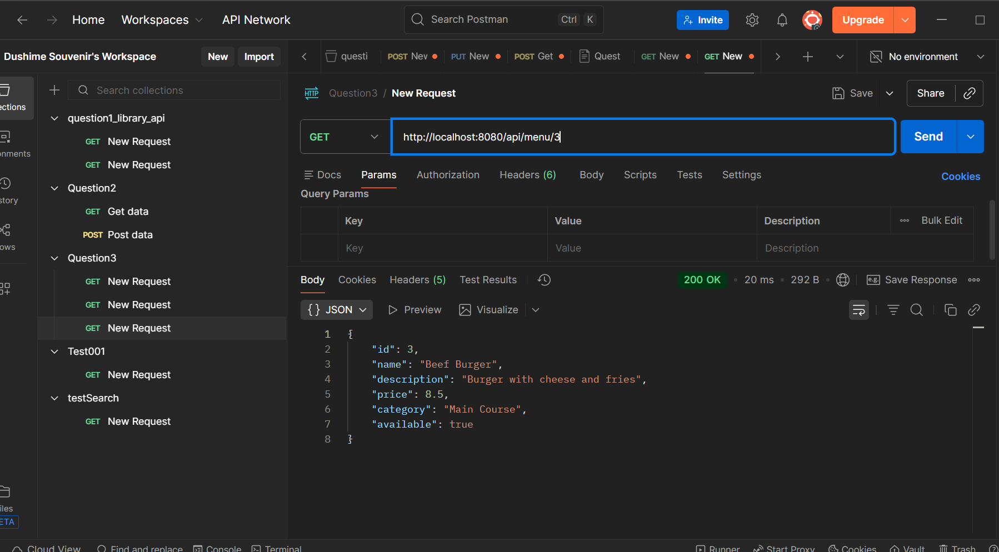
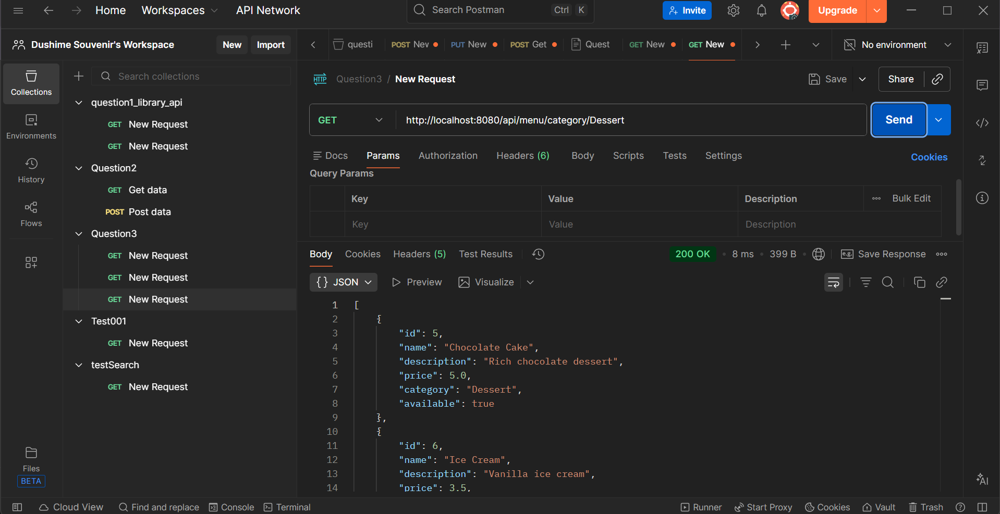
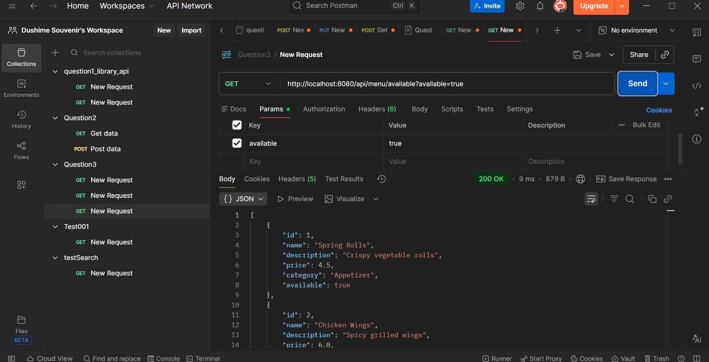
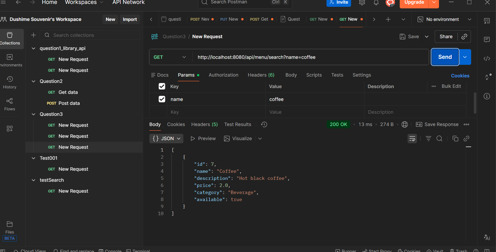
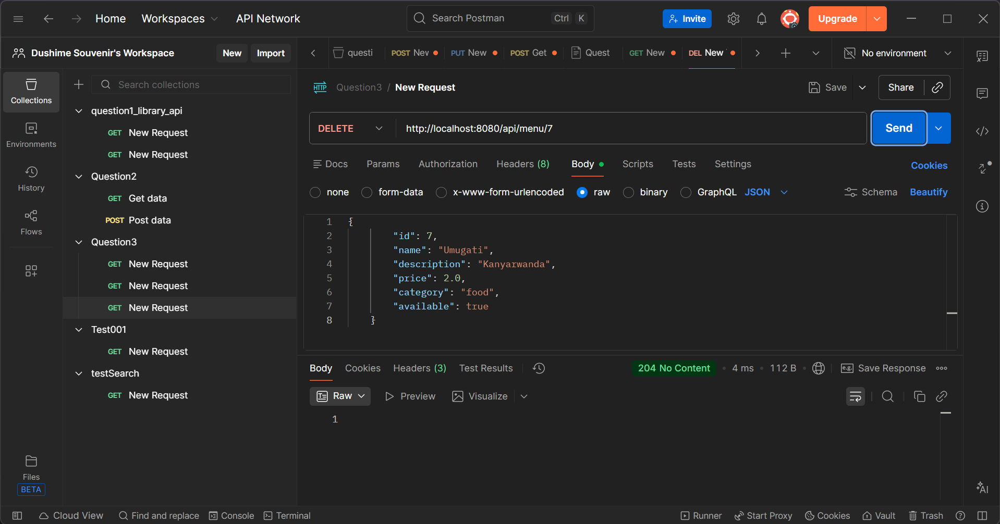

# Restaurant Management API

This project implements a backend API for a Restaurant Management System using Java and Spring Boot. It provides endpoints to manage menu items, including retrieving, searching, adding, updating, and deleting items.

## Technologies Used

*   **Java 21**
*   **Spring Boot 3.x**
*   **Maven**

## Getting Started

To run this application, you need to have Java and Maven installed on your machine.

1.  Navigate to the project directory.
2.  Run the application using Maven:

```bash
mvn spring-boot:run
```

The API will be accessible at `http://localhost:8080/api/menu`.

## API Endpoints & Testing
Here are some of the API endpoints we have tested using Postman. Note that these are selected examples; additional screenshots of our testing can be found in the `screenshoots` folder of this project.

### 1. Get All Menu Items
Retrieves a list of all menu items.
**Method:** `GET`
**URL:** `/api/menu`



### 2. Get Menu Item by ID
Retrieves a specific menu item by its unique ID.
**Method:** `GET`
**URL:** `/api/menu/{id}`



### 3. Get Menu Items by Category
Retrieves all menu items that belong to a specific category (e.g., "Main Course").
**Method:** `GET`
**URL:** `/api/menu/category/{category}`



### 4. Get Available Menu Items
Retrieves menu items based on their availability status.
**Method:** `GET`
**URL:** `/api/menu/available?available=true`



### 5. Search Menu Items by Name
Searches for menu items containing the specified name string.
**Method:** `GET`
**URL:** `/api/menu/search?name={name}`



### 6. Delete Menu Item
Deletes a menu item by its ID.
**Method:** `DELETE`
**URL:** `/api/menu/{id}`


